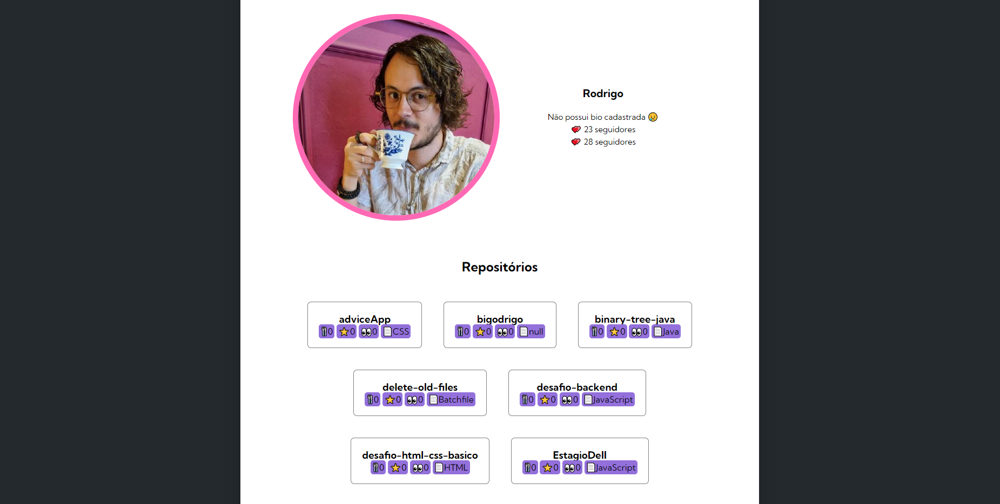

# GitHub fetch challenge

This project is a milestone of a FullStack developer course, serving to reinforce foundational principles and then upload it to a GitHub repository.

## Table of contents

- [Overview](#overview)
  - [The challenge](#the-challenge)
  - [Layout](#-layout)
  - [Links](#links)
- [My process](#my-process)
  - [Technologies](#-technologies)
  - [What I learned](#what-i-learned)
- [Author](#author)

## Overview

### The challenge

Users have the ability to enter information into the designated input field. Upon submission, the information of an existing GitHub account will be loaded.
The initial state of the challenge included a basic structure with HTML, styles, and JavaScript codes for the username and the user's first 10 repositories.

My improvements allow users to:

- [x] View the number of followers and individuals they are following;
- [x] Display the user's last 10 events, but only from repositories that have been updated or created;
- [x] Retrieve additional information from the repositories, such as the number of stars, watchers, forks, and the most commonly used language.


### 🔖 Layout

<div align="center">
    <p>User information:</p>
    
</div>

<div align="center">
    <p>Events information:</p>
    
</div>

### Links

- Starting Point URL: [GitHub Repo](https://github.com/devemdobro/projeto-inicial-fetch-github-api)
- Solution URL: [GitHub Repo](https://github.com/bigodrigo/projeto-fetch-git)
- Live Site URL: [GitHub Page](https://bigodrigo.github.io/projeto-fetch-git)

## My process

### 🚀 Technologies

- Semantic HTML5 markup
- CSS custom properties
- Flexbox
- JavaScript
- API manipulation

### What I learned

- I have prior experience working on projects involving JavaScript. In this project, I explored a different method of manipulating the document to verify if a field is empty, and also implemented the use of the "ENTER" button on the user's keyboard. 
- It is important to note that there is no need for authentication, as the information accessed is limited to what the user has made public. There is a validation process for missing data, such as cases where users do not have a bio. Additionally, there are two different methods of limiting the list of repositories to a maximum of 10, either by using the "?per_page=" parameter or by using conditional statements and array length.
- Another noteworthy aspect is that the code structure keeps the fetch call as a service and utilizes objects to handle its responses. These objects have their own functions that facilitate the rendering of the page.

```js
    document.getElementById('btn-search').addEventListener('click', () => {
        const userName = document.getElementById('input-search').value
        if(validateEmptyInput(userName)) return
        getUserData(userName)})
    document.getElementById('input-search').addEventListener('keyup', (e) => {
        const userName = e.target.value
        const key = e.which || e.keyCode
        const isEnterKeyPressed = key === 13
        if (isEnterKeyPressed) {
            if(validateEmptyInput(userName)) return
            getUserData(userName)
        }})
```

```js
const events = {
    list: [],
    addEvent(gitHubEvent) {
        if (this.list.length < 10) {
            if (gitHubEvent.type === 'PushEvent' || gitHubEvent.type === 'CreateEvent') {
                const event = {
                    type: gitHubEvent.type,
                    repoName: gitHubEvent.repo.name,
                    message: gitHubEvent.payload && gitHubEvent.payload.commits ? gitHubEvent.payload.commits[0].message : 'Created'};
                this.list.push(event);}}},
    clearEvents() {
        this.list = [];
    }};
```

## Author

- Portfolio - [Rodrigo](https://portfolio-bigodrigo.vercel.app/)
- GitHub - [bigodrigo](https://github.com/bigodrigo)
- Linkedin - [rodrigo-boquer](https://www.linkedin.com/in/rodrigo-boquer/)